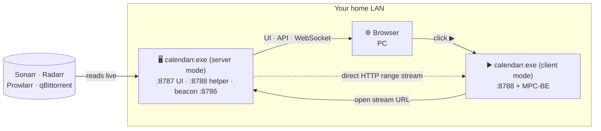

<div align="center">


### A self-hosted calendar &amp; remote for your *arr media stack

One Go binary. Zero config. Plays to any screen on your LAN.

[](LICENSE)


</div>

<div align="center">


</div>

## What is Calendarr?

Calendarr turns your **Sonarr / Radarr / Prowlarr / qBittorrent** setup into one friendly web app — a **calendar of your episodes and movies** that you open from any browser on your network (PC only for now) and **press ▶ to watch**.

Think of it as a lightweight, Plex-style front door for the *arr stack you already run, with **no VPS, no accounts, no port-forwarding, and no Node build step**. It's a single self-contained executable that reads Sonarr live, remembers what you've watched, and streams the file straight to your player.

> One household has quietly run a version of this for the better part of a decade. This is that setup, cleaned up and made shareable.

## Features

- 📅 **Live calendar** of upcoming, downloading, and downloaded episodes, straight from Sonarr — with series banners and a detail view.
- 🎬 **Movies, torrents & indexers** — dedicated pages wired to Radarr, qBittorrent, and Prowlarr (search, add, grab, pause/resume).
- ▶ **One-click play** — opens the file in **MPC-BE** on whichever machine you're watching from, streamed over plain HTTP (range/seek), never re-encoded.
- 👁️ **Watched tracking** — toggles persist in a local SQLite file; watched cards turn grayscale.
- ⚡ **Live updates** over WebSocket — download progress bars move in real time.
- 🔍 **Zero-config auto-detect** — finds Sonarr/Radarr/Prowlarr by reading their own `config.xml`. No API keys to copy by hand.
- 📡 **LAN auto-discovery** — a UDP beacon means a non-technical user never types an IP: open the helper and the calendar opens itself.
- 🖥️ **System tray + autostart**, single binary, **fully offline** — CSS, JS, and timezone data are all embedded, no CDN.
- 🌍 **Multilingual UI** — available in 9 languages (English, French, Spanish, German, Portuguese, Russian, Japanese, Korean, Chinese), auto-detected from the browser and switchable in Options.

## How it works



- **`calendarr.exe` in server mode** runs on the machine that hosts Sonarr. It reads Sonarr live, serves the UI + JSON API + WebSocket on **`:8787`**, exposes a loopback playback helper on **`:8788`** (so you can also watch from the server-box itself), keeps watched state in `calendarr.db`, and broadcasts a discovery beacon on **`:8786`**.
- **Any browser** on the LAN opens `http://<that-machine>:8787`.
- **`calendarr.exe` in client mode** runs on each *viewing* machine (Windows). It sits in the tray on **`:8788`** (loopback only); when you click ▶ in a browser **on that same machine**, it launches **MPC-BE** pointed at the stream URL. The video streams **directly** from the server to the player — it never passes through a third party or the cloud.
- **One binary, two modes.** It's the same `calendarr.exe`. Right-click the tray icon → switch between **Mode: Server** and **Mode: Client** (the app restarts itself). The choice is persisted in `config.json`.

## Requirements

- **Windows** — `calendarr.exe` is a system-tray app.
- **[Sonarr](https://sonarr.tv)** — the calendar source (required). **[Radarr](https://radarr.video)**, **[Prowlarr](https://prowlarr.com)**, and **[qBittorrent](https://www.qbittorrent.org)** are optional and light up their own pages.
- **[MPC-BE](https://sourceforge.net/projects/mpcbe/)** on each viewing machine, for playback.
- **[Go 1.26+](https://go.dev/dl/)** — only if you build from source.

## Download

Grab the prebuilt **`calendarr.exe`** from the **[latest release](https://github.com/luan220/Calendarr/releases/latest)** — one file, no Go toolchain, no build step. Same binary on every machine; pick its mode the first time you run it via the tray menu (right-click → **Mode: Server** or **Mode: Client**).

Windows only — it's a system-tray app. Prefer to compile it yourself? See [Build from source](#build-from-source).

## Build from source

```sh
git clone https://github.com/<you>/calendarr.git
cd calendarr
```

**Release build** (Windows PowerShell) — produces the self-contained `bin\calendarr.exe`:

```powershell
.\build.ps1
```

`build.ps1` compiles with CGO and the mingw-w64 toolchain, statically linking the C runtime, so the binary has no external DLL dependency beyond the system Universal CRT. One-time toolchain install:

```powershell
winget install BrechtSanders.WinLibs.POSIX.UCRT
```

The release binary targets **x86-64-v3** CPUs (Intel Haswell 2013+ / AMD Excavator 2015+); on an older CPU it prints a clear message and exits instead of crashing.

**Quick dev build** — no mingw needed, keeps a console for logs:

```sh
go build -o calendarr.exe ./cmd/server
```

Add `-ldflags "-H=windowsgui"` to hide the console (the tray-only mode `build.ps1` ships), or run with `-notray -dev` to live-reload the `web/` UI without rebuilding.

Version info, icon, and Windows manifest are embedded via the committed `cmd/server/rsrc.syso`. To regenerate it after bumping the version in `cmd/server/versioninfo.json`:

```sh
go install github.com/josephspurrier/goversioninfo/cmd/goversioninfo@latest
go generate ./cmd/server
```

## Running it

1. Copy **`calendarr.exe`** to the machine that runs Sonarr and start it. By default it boots in **server mode** and auto-detects Sonarr (and optionally Radarr/Prowlarr/Bazarr/qBittorrent) on the same box.
2. Open **`http://<server-machine>:8787`** in a browser — from any device on your LAN.
3. **On each PC you watch from** — typically a machine *other than* the server — copy the same `calendarr.exe`, run it once, then right-click the tray icon → **Mode: Client**. The app restarts in client mode (playback helper only, listens on loopback `:8788`). Then click ▶ in the calendar and the episode opens in MPC-BE, streamed straight from the server.

> **One binary, two modes.** Server mode = full calendar + Sonarr/Radarr/etc. + ability to play locally. Client mode = playback helper only, no Sonarr needed. Switch any time via the tray menu — the choice is persisted in `config.json` next to the exe.

> **Browsing vs. playing.** *Any* device can open the calendar (phone, tablet, smart TV). But the ▶ button only works on a **Windows PC running `calendarr.exe` + MPC-BE**, because the browser launches the player through a local helper. So you can browse from your phone, then hit play from a PC.

## Configuration

Everything auto-detects when the *arr apps live on the same machine as the server. For anything remote — or to set qBittorrent credentials, or to switch mode by editing the file directly — drop a `config.json` next to `calendarr.exe` (a blank template is written on first run):

```json
{
  "mode": "server",
  "sonarrUrl": "http://localhost:8989",
  "sonarrKey": "",
  "qbitUrl": "http://localhost:9191",
  "qbitUser": "admin",
  "qbitPass": "",
  "prowlarrUrl": "",
  "prowlarrKey": "",
  "radarrUrl": "",
  "radarrKey": ""
}
```

Command-line flags override the config file — run `calendarr.exe -h` for the full list. Default ports: server `8787`, discovery beacon `8786`, playback helper `8788` (loopback).

## Disclaimer

Calendarr is a **controller and viewer** for software you install and run yourself. Like Sonarr, Radarr, and the rest of the *arr ecosystem, it **does not host, provide, or distribute any media** — it only talks to the tools already on your own machines. You are responsible for how you use it and for complying with the laws in your country.

## Contributing

Issues and pull requests are welcome. This is a personal project shared in the hope that it's useful, so responses may be slow — but well-scoped fixes and reports are appreciated.

## License

[GPL-3.0](LICENSE) — the same copyleft license as the rest of the *arr stack.

## Acknowledgements

Standing on the shoulders of **Sonarr**, **Radarr**, **Prowlarr**, **qBittorrent**, and **MPC-BE**. Thank you to those communities.
