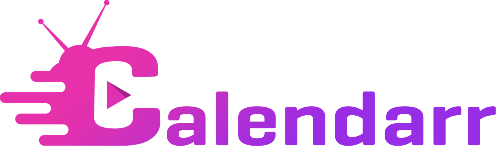
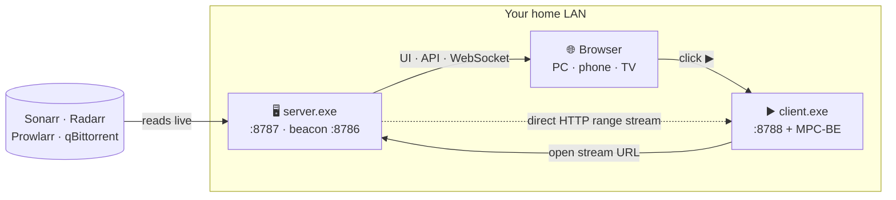

<div align="center">



### A self-hosted calendar &amp; remote for your *arr media stack

One Go binary. Zero config. Plays to any screen on your LAN.

[](LICENSE)


</div>

<!-- Add screenshots here once you have them, e.g.:


-->

## What is Calendarr?

Calendarr turns your **Sonarr / Radarr / Prowlarr / qBittorrent** setup into one friendly web app — a **calendar of your episodes and movies** that you open from any browser on your network (PC, phone, TV) and **press ▶ to watch**.

Think of it as a lightweight, Plex-style front door for the *arr stack you already run, with **no VPS, no accounts, no port-forwarding, and no Node build step**. It's a single self-contained executable that reads Sonarr live, remembers what you've watched, and streams the file straight to your player.

> One household has quietly run a version of this for the better part of a decade. This is that setup, cleaned up and made shareable.

## Features

- 📅 **Live calendar** of upcoming, downloading, and downloaded episodes, straight from Sonarr — with series banners and a detail view.
- 🎬 **Movies, torrents & indexers** — dedicated pages wired to Radarr, qBittorrent, and Prowlarr (search, add, grab, pause/resume).
- ▶ **One-click play** — opens the file in **MPC-BE** on whichever machine you're watching from, streamed over plain HTTP (range/seek), never re-encoded.
- 👁️ **Watched tracking** — toggles persist in a local SQLite file; watched cards turn grayscale.
- ⚡ **Live updates** over WebSocket — download progress bars move in real time.
- 🔍 **Zero-config auto-detect** — finds Sonarr/Radarr/Prowlarr by reading their own `config.xml`. No API keys to copy by hand.
- 📡 **LAN auto-discovery** — a UDP beacon means a non-technical user never types an IP: open the helper and the calendar opens itself.
- 🖥️ **System tray + autostart**, single binary, **fully offline** — CSS, JS, and timezone data are all embedded, no CDN.

## How it works



- **`server.exe`** runs on the machine that hosts Sonarr. It reads Sonarr live, serves the UI + JSON API + WebSocket on **`:8787`**, keeps watched state in `calendarr.db`, and broadcasts a discovery beacon on **`:8786`**.
- **Any browser** on the LAN opens `http://<that-machine>:8787`.
- **`client.exe`** runs on each *viewing* machine (Windows). It sits in the tray on **`:8788`** (loopback only); when you click ▶ in a browser **on that same machine**, it launches **MPC-BE** pointed at the stream URL. The video streams **directly** from the server to the player — it never passes through a third party or the cloud.

## Requirements

- **Windows** — both binaries are system-tray apps.
- **[Sonarr](https://sonarr.tv)** — the calendar source (required). **[Radarr](https://radarr.video)**, **[Prowlarr](https://prowlarr.com)**, and **[qBittorrent](https://www.qbittorrent.org)** are optional and light up their own pages.
- **[MPC-BE](https://sourceforge.net/projects/mpcbe/)** on each viewing machine, for playback.
- **[Go 1.26+](https://go.dev/dl/)** to build from source.

## Build from source

```sh
git clone https://github.com/<you>/calendarr.git
cd calendarr

# the server — runs on the box with Sonarr
go build -ldflags "-H=windowsgui" -o server.exe .

# the playback helper — runs on each viewing machine
go build -ldflags "-H=windowsgui" -o client.exe ./client
```

`-H=windowsgui` makes the apps run silently in the system tray (no console window). Drop it while developing to keep a console, or run the server with `-notray -dev` to live-reload the `web/` UI without rebuilding.

## Running it

1. Copy **`server.exe`** to the machine that runs Sonarr and start it. With Sonarr (and optionally Radarr/Prowlarr) on the same box, it auto-detects everything.
2. Open **`http://<server-machine>:8787`** in a browser — from any device on your LAN.
3. **On each PC you want to watch on**, run **`client.exe`** (it lives in the tray). Every viewing machine needs its own copy — whether that's the server itself or a *different* PC on the network — because the browser hands playback to a helper running locally on that same machine. Then click ▶ and the episode opens in MPC-BE, streamed straight from the server.

> **Browsing vs. playing.** *Any* device can open the calendar (phone, tablet, smart TV). But the ▶ button only works on a **Windows PC running `client.exe` + MPC-BE**, because the browser launches the player through a local helper. So you can browse from your phone, then hit play from a PC.

## Configuration

Everything auto-detects when the *arr apps live on the same machine as the server. For anything remote — or to set qBittorrent credentials — drop a `config.json` next to `server.exe` (a blank template is written on first run):

```json
{
  "sonarrUrl": "http://localhost:8989",
  "sonarrKey": "",
  "qbitUrl": "http://localhost:9191",
  "qbitUser": "admin",
  "qbitPass": "",
  "prowlarrUrl": "",
  "prowlarrKey": "",
  "radarrUrl": "",
  "radarrKey": ""
}
```

Command-line flags override the config file — run `server.exe -h` for the full list. Default ports: server `8787`, discovery beacon `8786`, playback helper `8788`.

## Disclaimer

Calendarr is a **controller and viewer** for software you install and run yourself. Like Sonarr, Radarr, and the rest of the *arr ecosystem, it **does not host, provide, or distribute any media** — it only talks to the tools already on your own machines. You are responsible for how you use it and for complying with the laws in your country.

## Contributing

Issues and pull requests are welcome. This is a personal project shared in the hope that it's useful, so responses may be slow — but well-scoped fixes and reports are appreciated.

## License

[GPL-3.0](LICENSE) — the same copyleft license as the rest of the *arr stack.

## Acknowledgements

Standing on the shoulders of **Sonarr**, **Radarr**, **Prowlarr**, **qBittorrent**, and **MPC-BE**. Thank you to those communities.
